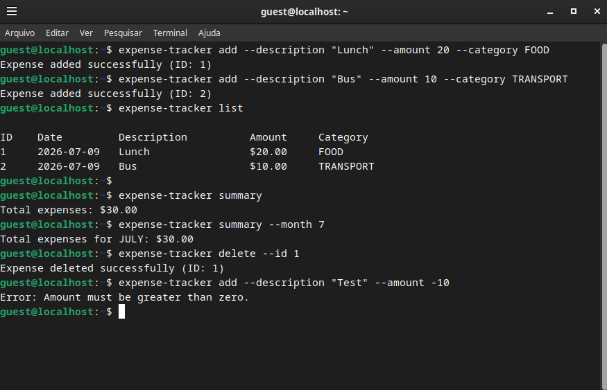

# 💰 Expense Tracker

Aplicação de linha de comando (CLI) desenvolvida em **Java** para gerenciar suas finanças pessoais. Permite adicionar, atualizar, excluir e visualizar despesas, além de gerar resumos financeiros por período.

> 🗺️ Este projeto é parte do desafio [Expense Tracker](https://roadmap.sh/projects/expense-tracker) do **roadmap.sh**



---

## 📋 Funcionalidades

- ✅ Adicionar despesas com descrição, valor e categoria
- ✅ Atualizar despesas existentes
- ✅ Excluir despesas por ID
- ✅ Listar todas as despesas (com filtro por categoria)
- ✅ Resumo total de despesas
- ✅ Resumo de despesas por mês
- ✅ Validação de entradas com mensagens de erro claras
- ✅ Persistência de dados em arquivo JSON

---

## 🛠️ Tecnologias

| Tecnologia | Versão | Uso |
|---|---|---|
| Java | 17+ | Linguagem principal |
| Maven | 3.x | Build e dependências |
| Picocli | 4.7.5 | Parser de argumentos CLI |
| Gson | 2.10.1 | Serialização/deserialização JSON |
| JUnit 5 | 5.10.2 | Testes unitários |

---

## 📦 Pré-requisitos

- [Java 17+](https://adoptium.net)
- [Maven 3.x](https://maven.apache.org/download.cgi)

Para verificar se estão instalados:

```bash
java -version
mvn -version
```

---

## 🚀 Instalação

### Linux

```bash
# 1. Clone o repositório
git clone https://github.com/anaClarissi/expense-tracker.git
cd expense-tracker

# 2. Execute o instalador
./install.sh
```

### Windows

```cmd
# 1. Clone o repositório
git clone https://github.com/anaClarissi/expense-tracker.git
cd expense-tracker

# 2. Execute o instalador como Administrador
install.bat
```

O instalador compila o projeto e configura o comando `expense-tracker` globalmente no terminal.

---

## 📖 Comandos

### Adicionar despesa

```bash
expense-tracker add --description "Lunch" --amount 20
expense-tracker add --description "Bus" --amount 5 --category TRANSPORT
```

### Atualizar despesa

```bash
expense-tracker update --id 1 --description "Dinner" --amount 35
expense-tracker update --id 1 --description "Dinner" --amount 35 --category FOOD
```

### Excluir despesa

```bash
expense-tracker delete --id 1
```

### Listar despesas

```bash
# Listar todas
expense-tracker list

# Filtrar por categoria
expense-tracker list --category FOOD
```

### Resumo

```bash
# Total geral
expense-tracker summary

# Total por mês
expense-tracker summary --month 7
```

---

## 🏷️ Categorias disponíveis

| Categoria | Descrição |
|---|---|
| `FOOD` | Alimentação |
| `TRANSPORT` | Transporte |
| `HEALTH` | Saúde |
| `ENTERTAINMENT` | Entretenimento |
| `EDUCATION` | Educação |
| `OTHER` | Outros (padrão) |

> As categorias são **case-insensitive**: `food`, `Food` e `FOOD` funcionam igual.

---

## ⚠️ Tratamento de Erros

| Situação | Mensagem |
|---|---|
| Valor negativo ou zero | `Error: Amount must be greater than zero.` |
| Descrição vazia | `Error: Description cannot be empty.` |
| ID inexistente | `Error: Expense not found with ID: X` |
| Mês inválido | `Error: Invalid month. Use a value between 1 and 12.` |
| Categoria inválida | `Error: Invalid category: 'X'. Valid values: FOOD, TRANSPORT...` |

---

## 🧪 Testes

Para rodar os testes:

```bash
mvn test
```

```
Tests run: 22, Failures: 0, Errors: 0, Skipped: 0 ✅
```

| Classe | Tipo | Cenários |
|---|---|---|
| `ExpenseServiceTest` | Unitário | CRUD, validações, edge cases (13 testes) |
| `SummaryServiceTest` | Unitário | Totais, filtros por mês (4 testes) |
| `ExpenseRepositoryTest` | Integração | Leitura/escrita em arquivo (5 testes) |

---

## 📁 Estrutura do Projeto

```
expense-tracker/
├── src/
│   ├── main/java/
│   │   ├── cli/              # Comandos CLI (picocli)
│   │   ├── exceptions/       # Exceptions customizadas
│   │   ├── model/            # Entidades (Expense, Category)
│   │   ├── repository/       # Persistência em JSON
│   │   ├── service/          # Regras de negócio
│   │   └── utils/            # Utilitários (adapters, converters)
│   └── test/java/
│       ├── service/          # Testes unitários
│       └── repository/       # Testes de integração
├── install.sh                # Instalador Linux
├── install.bat               # Instalador Windows
└── pom.xml
```

---

## 👩‍💻 Autora

Desenvolvido por **Ana Clarissi**

- 🗺️ roadmap.sh: [roadmap.sh/u/anaclarissi](https://roadmap.sh/u/anaclarissi)
- 💼 LinkedIn: [linkedin.com/in/anaclarissi](https://linkedin.com/in/anaclarissi)

---

## 📄 Licença

Este projeto foi desenvolvido como parte do desafio [Expense Tracker](https://roadmap.sh/projects/expense-tracker) do roadmap.sh.